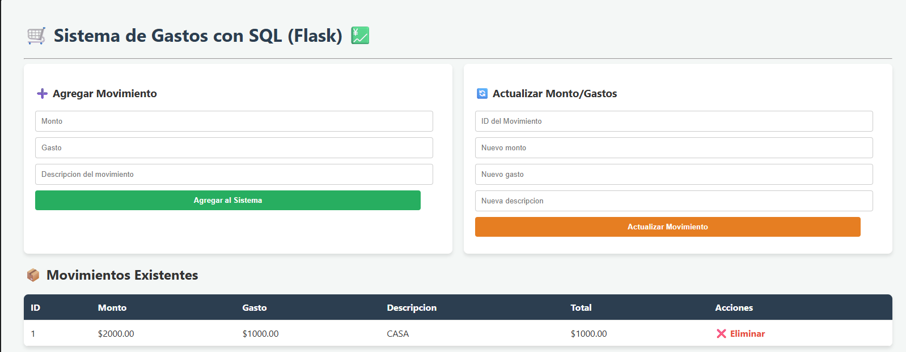

# 🛒 Sistema de Gestor de Gastos Web

¡Bienvenido al **Gestor de Gastos Web**! Esta es una aplicación web dinámica y ligera desarrollada en **Python** utilizando el micro-framework **Flask** y **SQLite** como sistema de gestión de bases de datos. Permite a los usuarios administrar ingresos (montos),(gastos) y descripciones de movimientos financieros en tiempo real con una interfaz limpia, moderna y profesional.
<p align="center">
  
</p>
---

## 🚀 Características Principales

* **Operaciones CRUD Completas:**
    * **Agregar:** Registra nuevos movimientos calculando automáticamente el saldo neto (`Monto - Gasto`).
    * **Visualizar:** Muestra todos los registros en una tabla dinámica ordenados por ID.
    * **Actualizar:** Modifica registros existentes buscando de forma segura por su ID único.
    * **Eliminar:** Borra movimientos del sistema con una alerta de confirmación nativa para evitar accidentes.
* **Cálculo Automatizado:** Muestra el balance general de todos los movimientos sumados en la parte inferior de la pantalla.
* **Sistema de Alertas (Flash Messages):** Notificaciones visuales al usuario cuando una operación es exitosa o si ocurre un error.
* **Exportación de Reportes Dinámicos:** Descarga tus datos al instante en tres formatos clave:
    * 📄 **TXT:** Reporte plano tabulado y estético.
    * 📊 **CSV:** Ideal para abrir y analizar directamente en Excel.
    * ⚙️ **JSON:** Estructura de datos limpia lista para integraciones o respaldos.

---

## 🛠️ Tecnologías Utilizadas

* **Backend:** Python 3 (Módulos: `sqlite3`, `io`, `csv`, `json`)
* **Framework Web:** Flask
* **Frontend:** HTML5, CSS3 (Diseño responsivo basado en Flexbox)
* **Base de Datos:** SQLite (Archivo local `inventario.db`)

---

## 📂 Estructura del Proyecto

El proyecto mantiene una arquitectura limpia estándar para aplicaciones Flask:

```text
GESTOR_DE_GASTOS/
│
├── 📁 templates/
│   └── 📄 inventario.html       # Interfaz gráfica (HTML + CSS + Jinja2)
│
├── 📄 Gestor_Gastos.py          # Lógica principal del servidor y rutas (Backend)
├── 📄 inventario.db             # Base de Datos generada automáticamente (SQLite)
├── 📄 .gitignore                # Archivos excluidos del control de versiones
└── 📄 README.md                 # Documentación del proyecto